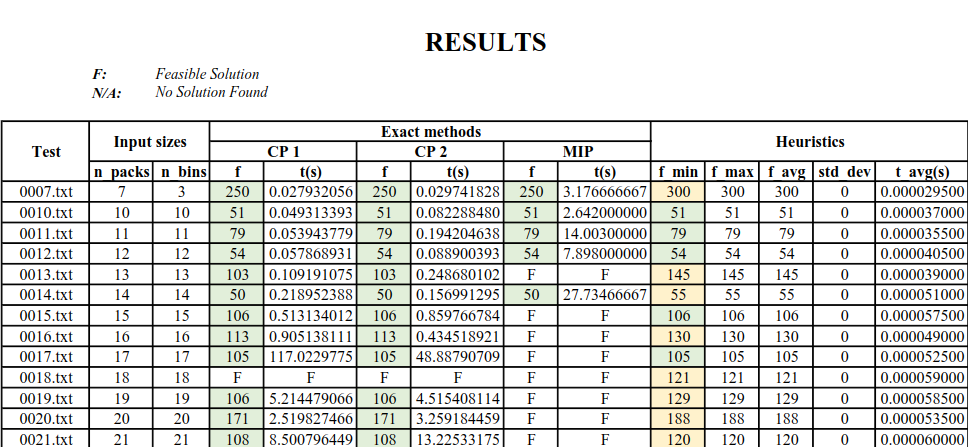
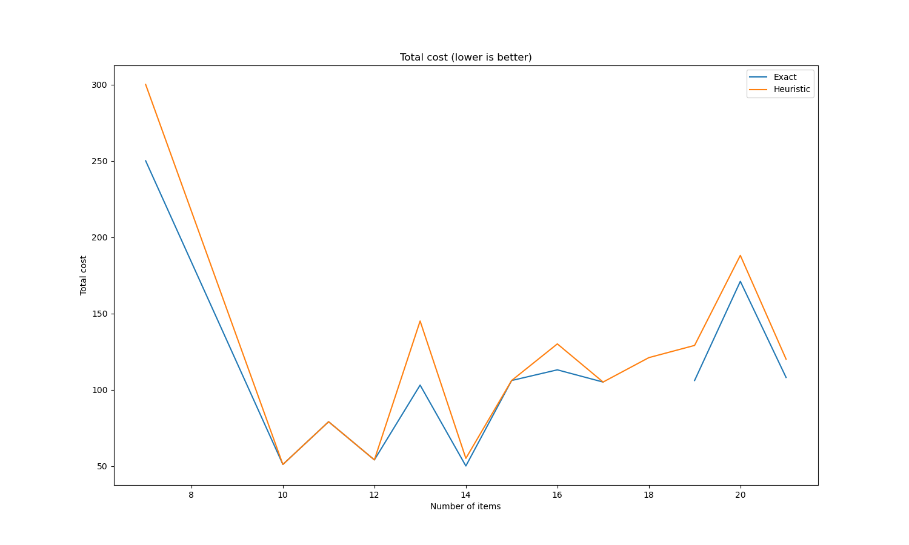
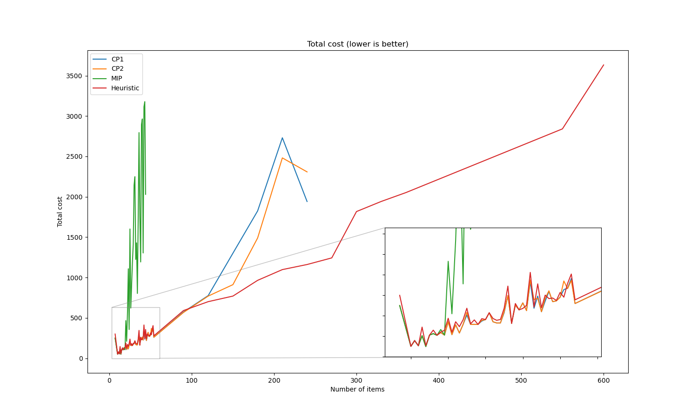
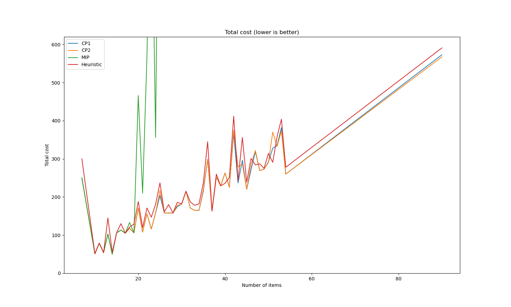
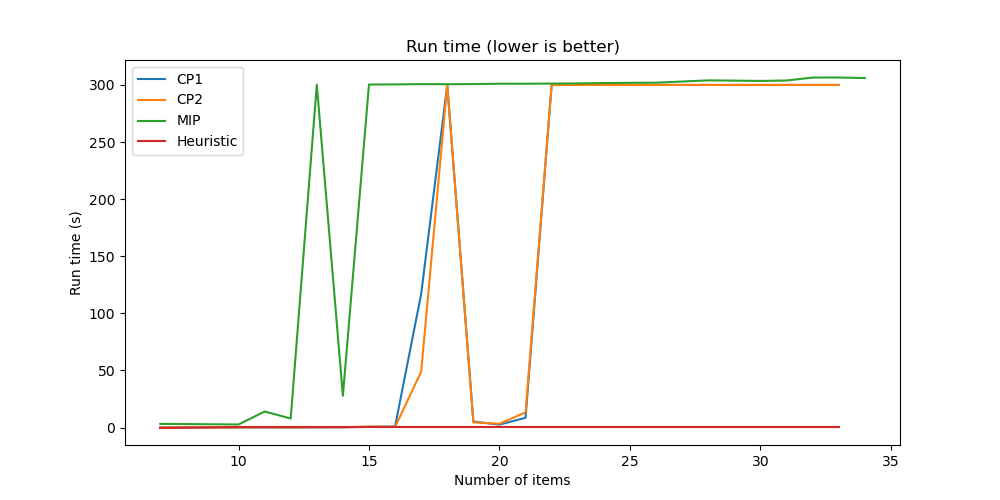

## Problem
`K` trucks `1, 2, ..., K` are available for transporting `N` packages `1, 2, ..., N`. Each truck `k` has the container size of `Wk x Hk`. The dimensions of each package `i` are `wi x hi`. Packages that are placed in the same container must not overlap. Assume that the number K can be large, leading to a great number of trucks that are not being used. `Ck` represents the cost of using truck `k`. Find a solution that loads all the packages into those given trucks such that **the total cost of trucks used is minimal**.  

*Throughout our mini-project, some concepts are also being used instead of trucks (bins, cars) and packages (items)*

The input data format and how we generated them can be found [here](./input_data/README.md)   

Usage can be found [here](./USAGE.md)

## Results
- CP gives exact solutions for tests with sizes: `7 x 3`, `10 x 10`, `11 x 11`, `12 x 12`, `13 x 13`, `14 x 14`, `15 x 15`, `16 x 16`, `17 x 17`, `19 x 19`, `20 x 20`, `21 x 21`.
- MIP gives exact solutions for tests with sizes: `7 x 3`, `10 x 10`, `11 x 11`, `12 x 12`, `14 x 14`.  

<!-- | Input    	|       |    CP 1       |       |      CP 2     |       |       MIP     |       |       Heuristic       |
|----------	|-----	|-------------	|-----	|-------------	|-----	|-------------	|-----	|---------------------	|
|          	| f   	| t (s)       	| f   	| t (s)       	| f   	| t (s)       	| f   	| t (s)               	|
| 0007.txt 	| 250 	| 0.027932056 	| 250 	| 0.029741828 	| 250 	| 3.176666667 	| 300 	| 0.000063000 	|
| 0010.txt 	| 51  	| 0.049313393 	| 51  	| 0.082288480 	| 51  	| 2.642000000 	| 51  	| 0.000119500 	|
| 0011.txt 	| 79  	| 0.053943779 	| 79  	| 0.194204638 	| 79  	| 14.00300000 	| 79  	| 0.000111500 	|
| 0012.txt 	| 54  	| 0.057868931 	| 54  	| 0.088900393 	| 54  	| 7.898000000 	| 54  	| 0.00012350  	|
| 0013.txt 	| 103 	| 0.109191075 	| 103 	| 0.248680102 	|     	|             	| 145 	| 0.000121000 	|
| 0014.txt 	| 50  	| 0.218952388 	| 50  	| 0.156991295 	| 50  	| 27.73466667 	| 55  	| 0.000147000 	|
| 0015.txt 	| 106 	| 0.513134012 	| 106 	| 0.859766784 	|     	|             	| 106 	| 0.000147500 	|
| 0016.txt 	| 113 	| 0.905138111 	| 113 	| 0.434518921 	|     	|             	| 130 	| 0.000178500 	|
| 0017.txt 	| 105 	| 190.2477704 	| 105 	| 48.88790709 	|     	|             	| 105 	| 0.000175500 	|
| 0018.txt 	|     	|             	|     	|             	|     	|             	| 121 	| 0.000196500 	|
| 0019.txt 	| 106 	| 5.214479066 	| 106 	| 4.515408114 	|     	|             	| 129 	| 0.000239000 	|
| 0020.txt 	| 171 	| 2.519827466 	| 171 	| 3.259184459 	|     	|             	| 188 	| 0.000226000 	|
| 0021.txt 	| 108 	| 8.500796449 	| 108 	| 13.22533175 	|     	|             	| 120 	| 0.000229500 	| -->

**All:**
- CP cannot handle data sets larger than 240 x 240. 
- MIP cannot handle data sets larger than 44 x 44.
- Heuristic can handle all test cases (the largest test size is 10,000 x 10,000).

**Comparing all results (total cost):**
- MIP gives the **worst** results.
- CP1 and CP2 give **nearly equivalent** results, but with larger data sets, CP2 gives better results.
- Heuristic gives really good results, with tests of size <100 x 100 it is still a bit inferior to CP, but for all other tests it is significantly better.

**Comparing all run time:**

- MIP reaches the time limit of 300 seconds for all tests with size >= 15 x 15.
- CP reaches the time limit of 300 seconds for all tests with size >= 22 x 22.
- Heuristic has a very short run time, every test is under 1 second, even for the test size of 10,000 x 10,000.

**Therefore:**

- MIP is not good in terms of results and run time,
- CP is better than MIP, with better results and faster run time (in some early tests),
- Heuristic gives the best results in both cost and run time. 

